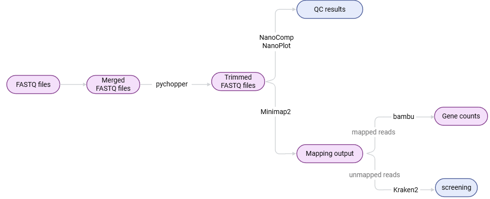

# Dual RNA-Seq workflow
This Nextflow pipeline is designed for the analysis of dual RNA-seq data from vaginal swabs. It performs preprocessing, quality control (QC), mapping, and quantification of reads from host (Homo sapiens), yeast (Candida albicans) and bacterial genomes.

## Tools used in the workflow

* [Nextflow](https://www.nextflow.io/)
* [Diamond](https://github.com/bbuchfink/diamond)
* [Nanopack](https://github.com/wdecoster/nanopack)
* [Pychopper](https://github.com/epi2me-labs/pychopper)
* [Minimap2](https://github.com/lh3/minimap2)
* [MMseqs2](https://github.com/soedinglab/MMseqs2)
* [Samtools](http://www.htslib.org/)
* [Kraken2](https://ccb.jhu.edu/software/kraken/)
* [bambu](https://hub.docker.com/r/mathiasverbeke/bambu_runner)

## Possibilities
- QC control of the reads
- Trim reads
- Mapping of reads against Homo sapiens, Candida albicans and bacterial reference genomes
- Taxonomic classification of unmapped reads
- Quantification

## Wiki pages
The workflow can be executed in two ways:  
- Using the singular scripts
- Using Nextflow

For more information on how to start, refer to the Standard Operating Procedures of [Nextflow](https://github.com/MeryemAk/dRNASeq/wiki/Standard-Operating-Procedure-for-Nextflow) or the [scripts](https://github.com/MeryemAk/dRNASeq/wiki/Standard-Operating-Procedure-for-scripts).

## Other remarks
Each time Nextflow is executed, directories within the work directory are created where the processes run. Don't forget to empty this work direcotry regulary.

