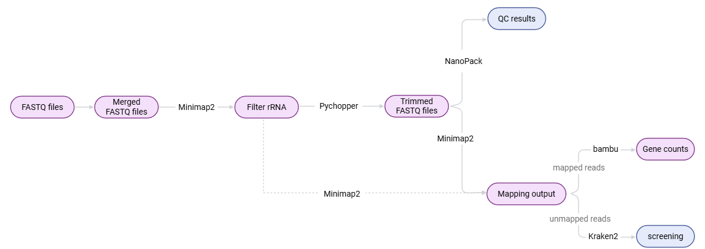

# Dual RNA-Seq workflow
This Nextflow pipeline is designed for the analysis of dual RNA-seq data from vaginal swabs. It performs preprocessing, quality control (QC), mapping, and quantification of reads from both host (human) and microbial (Candida and bacterial) genomes. The workflow is compatible with Linux and Windows and uses Docker containers for tool execution, ensuring platform independence. The container images are freely available on the [StaPH-B Docker repository](https://hub.docker.com/).

## Tools used in the workflow



* [Nextflow](https://www.nextflow.io/)
* [Nanocomp](https://github.com/wdecoster/nanocomp)
* [Nanoplot](https://github.com/wdecoster/NanoPlot)
* [Pychopper](https://github.com/epi2me-labs/pychopper)
* [Minimap2](https://github.com/lh3/minimap2)
* [Samtools](http://www.htslib.org/)
* [Kraken2](https://ccb.jhu.edu/software/kraken/)
* [featureCounts](https://subread.sourceforge.net/featureCounts.html)

## Possibilities
- QC control of the reads
- Trim reads
- Mapping of reads against human, Candida and bacterial reference genomes
- Taxonomic classification of unmapped reads
- Quantification

## Installation Linux
### Prerequisites
On Linux, only Docker is needed: the workflow is started from a Nextflow container. Users can also opt to install [Nextflow](https://www.nextflow.io/docs/latest/getstarted.html).  

## Quick start
1) Set up Docker on Linux:
```bash
# Install Docker
sudo dnf install docker

# Start & enable Docker
sudo systemctl start docker
sudo systemctl enable docker

# Verify if docker is running correctly
sudo systemctl status docker      # --> active (running)
```


2) Clone the Github repository.

3) Build the Docker images for nanocomp and nanopack.
```bash
# Build Docker image for nanocomp
# Move into the nanocomp folder
cd dRNASeq/nanocomp
# Execute the following command to build the Docker image
docker build -t nanocomp:v1 .       # Takes approximately 30 minutes

# Build Docker image for nanopack
# Move into the nanopack folder
cd dRNASeq/nanopack
# Execute the following command to build the Docker image
docker build -t nanopack:v1 .       # Takes approximately 45 minutes
```

4) The data to be analyzed must also be placed in the dRNASeq folder. For details on the required input folder structure, refer to the mandatory parameters.

5) Before running the workflow for the first time, pull the Nextflow Docker image from Docker Hub. If you have already downloaded the image, you can skip this step and proceed to step 4.
```bash
docker pull nextflow/nextflow:21.04.3
```
6) Start the nextflow container. Don't forget to replace "nameoffolder" with your own folder name.
```bash
docker run -it --workdir $PWD -v /var/run/docker.sock:/var/run/docker.sock -v $HOME/"nameoffolder":$HOME/"nameoffolder" nextflow/nextflow:21.04.3 /bin/bash 
```
7) You are now inside the Nextflow container, and the workflow is ready to be executed. Each tool runs in its own separate container, which will be automatically pulled if it is not already available locally when the corresponding process in Nextflow starts.

## Usage
```bash
nextflow run main.nf --in_dir PATH --out_dir PATH
                         [--barcodes]
                         [--qc][--t_qc]
                         [--trimming] [--t-trimming]
                         [--mapping][--t_mapping]
                         [--kraken] [--t_kraken]
                         [--help]
 
For help: nextflow run main.nf --help
```

## Mandatory parameters
Two parameters are mandatory:
- in_dir: the input directory that contains the data that needed to be analysed
- out_dir: the output directory that will contain the results

Input should look like one of these examples:
  1. A fastq directory containing one subdirectory, which holds the FASTQ files (either in .fastq.gz or .fastq format):
      
  2. A fastq containing multiple subdirectories, each named by a barcode and holding FASTQ files (either in .fastq.gz or .fastq format):
      

## Additional parameters
 * [--barcodes]: (default: none) Comma separated list of barcode numbers that the user wants to analyse if barcodes are present. All barcodes are automatically analysed if barcodes are present but no --barcodes option is provided. Numbers should include the leading 0s. E.g. 03,08,11
 * Parameters related to Quality Control (QC):
    - [--qc]: (default: true) If provided, will perform QC analysis (NanoComp and NanoPlot)
    - [--t_qc]: (default: 4) Number of threads used for QC
 * Parameters related to trimming:
    - [--trimming]: (default: false) If provided, will perform trimming (Pychopper)
    - [--t_trimming]: (default: 4) Number of threads for trimming.
 * Parameters related to mapping:
   - [--mapping]: (default: true) If provided, will map sort and index reads against human, Candida and bacterial reference genomes
   - [--t_mapping]: ((default: 4), minimap2 uses t+1 during mapping) Number of threads used for mapping
 * Parameters related to Kraken2:
   - [--kraken]: (default: ture) If provided, will perform taxonomic classification of reads using Kraken2
   - [--t_kraken]: (default: 4) Number of threads used for Kraken2 taxonomic classification
 * Other:
   - [--ignore_errors] (default: false) Option to continue running the pipeline even if errors occur 


## Config file
In the config file (nextflow.config), the default parameters can be adjusted, f. ex. the threads used for all the different processes.
Next tot the parameter settings, computing resources can also be modified:
```bash
executor {
  name = 'local'
  queueSize = 5
  memory = '64 GB'
  cpus = 32
}
```

The maximum memory is limited by default on 64 GB, but should be adjusted to personal computer characteristics.
queueSize is limited to 5, which means that only 5 processes can be executed at once. If the default number of threads are used, this means that 20 (5x4) threads at once will be used. 
The user can also replace queueSize with "cpus" if wanted. 

In the config file the containers can be easily adjusted if other containers and/or version of a tool want to be used.

The report, trace and timeline section in the config file generates reports add the end of the workflow.

## Output
The output is structured in the following way:
- 01.preprocessed_data (merged and unzipped FASTQ files)
- 02.qc (NanoPlot and NanoComp output)
- 03.trimming (Pychopper output)
- 04.mapped_reads (mapped reads for human, Candida, and bacterial genomes)
- 05.kraken (Kraken2 taxonomic classification output)
- 06.quantification (gene counts for human, Candida and bacterial genomes - necessary for downstream analysis in R)

Along with these outputdirectories, 2 Nextflow reports are also generated:
- report: metrics about the workflow execution
- timeline: timeline for all processes

Output folder structure example:
```bash
<out_dir>/
├── 01.preprocessed_data/         # Merged and unzipped FASTQ files
│   ├── sample1.fastq
│   ├── sample2.fastq
│   └── ...
├── 02.qc/                        # Output from NanoPlot and NanoComp
│   ├── nanoplot/
│   │   ├── NanoPlot-report.html
│   │   └── ...
│   └── nanocomp/
│       ├── NanoComp-report.html
│       └── ...
├── 03.trimming/                  # Pychopper output (trimmed reads)
│   ├── sample1_trimmed.fastq
│   ├── sample2_trimmed.fastq
│   └── ...
├── 04.mapped_reads/             # BAM files: aligned reads
│   ├── human/
│   │   ├── sample1.bam
│   │   └── ...
│   ├── candida/
│   │   ├── sample1.bam
│   │   └── ...
│   └── bacteria/
│       ├── sample1.bam
│       └── ...
├── 05.kraken/                   # Kraken2 taxonomic classification output
│   ├── kraken_report.txt
│   └── kraken_summary.txt
├── 06.quantification/           # featureCounts output
│   ├── human_counts.txt
│   ├── candida_counts.txt
│   └── bacteria_counts.txt
├── report.html                  # Nextflow execution report
├── timeline.html                # Timeline of process execution
└── trace.txt                    # Optional: trace file if enabled in config
```

## Other remarks
Each time Nextflow is executed, directories within the work directory are created where the processes run. Don't forget to empty this work direcotry regulary.

